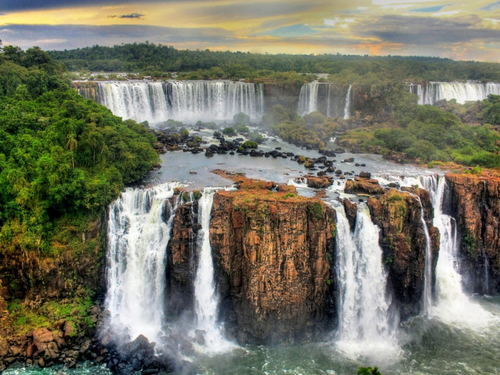
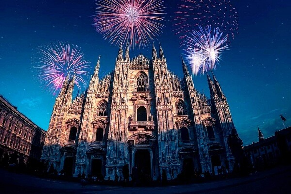

# Politecnico di Milano Artificial Neural Network and Deep Learning Competition
This is kaggle competition hosted by Politecnico di Milano

There are two challenges in the competition
 - Image Classification 
 - Image Segmentation
 

## 1. Image Classification

You will have 2 weeks to solve a classification problem on the proposed dataset, which contains images of several objects belonging to 20 different classes. Being a classification problem, given an image, the goal is to predict the correct class label. 

Given:
 - 1554 JPG files for training
 - 500 JPG files for testing
 - 20 different classes(such as water fall, fireworks, car..)
 - **Evaluation**: Multiclass Accuracy

**Below are the examples of input data**

      

*Test result*: 92% of accuracy. The model utilizes image augumentation that includes resizing, brightening, flipping horizontally and vertically the images. In addition, the model uses transfer learning to improve the results

## 2. Image Segmentation

You will have 2 weeks to solve a segmentation problem on the proposed dataset, which contains aerial images of different areas. Given an image, the goal is to segment buildings at pixel level, thus predicting for each pixel if it belongs to a building (class 1) or not (class 0).

    

Given:
 - Image size: 256x256 pixels
 - Color space: RGB
 - File Format: tif
 - Number of classes: 2
 - 'background' : 0
 - 'building' : 1 (corresponding to the value 255 in the stored masks)
 - Number of training images: 7647
 - Number of test images: 1234
 - **Evaluation**: IoU, Insertion over Union

*Test result*: of 0.5 of IoU. The model utilizes data augumentation and UNet as it is the standard approach for image segmentation.

